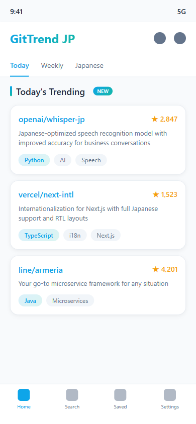

# GitTrend JP


日本人開発者向けの **GitHub トレンド毎日配信アプリ**。



## At a glance

- GitHub トレンドを日本人開発者向けにキュレーション
- 日本語 README があるリポジトリを優先的に扱う
- モバイルアプリとして毎朝のチェック導線を作る
- お気に入り保存で後で見返せる

## 概要

GitTrend JP は、GitHub のトレンドリポジトリを日本人開発者向けに整理して毎日配信する Flutter アプリです。

想定している価値は:

- トレンドの中から **日本語で追いやすい OSS** を見つけやすくする
- 毎日 1 回見るだけで、新しい開発ツールや OSS の流れを追えるようにする
- 気になった repo をアプリ内で保存して後から整理できるようにする

## 特徴

- 日本語 README があるリポジトリをフィルタリング
- 毎朝 8 時にプッシュ通知でトレンドを配信
- お気に入り保存でチェックしたいリポジトリを管理
- LINE / Yahoo / CyberAgent など日本企業 OSS を追跡

## 技術スタック

- **Framework**: Flutter 3.x
- **State Management**: Riverpod
- **Local DB**: Hive
- **API**: GitHub GraphQL API
- **Notifications**: Firebase Cloud Messaging

## Fork / clone 後の最短導線

この repo は Flutter / Firebase / Android 配布設定などが関わるため、fresh fork 直後はまず **ローカルでアプリが起動できるか** を確認するのが自然です。

最短導線:

1. Flutter SDK を用意する
2. `flutter pub get`
3. `flutter analyze`
4. `flutter test`
5. `flutter run`

詳細は `docs/quickstart-from-fork.md` を参照。

## ドキュメント

- [fork / clone quickstart](docs/quickstart-from-fork.md)
- [技術仕様書](docs/SPECIFICATION.md)
- [トラブルシューティング](docs/TROUBLESHOOTING.md)

## 開発

```bash
# 依存関係インストール
flutter pub get

# 静的解析
flutter analyze

# テスト
flutter test

# 開発サーバー起動
flutter run

# ローカルビルド
flutter build apk --release
flutter build web --release
```

## デプロイ

### Web (Vercel)

```bash
# Webビルド
flutter build web --release

# Vercelにデプロイ
npx vercel --prod --yes
```

**本番URL**: https://gittrend-jp.vercel.app/

### Android (Google Play Store)

GitHub Actions で自動デプロイ。タグを push するとトリガーされる。

```bash
# 1. pubspec.yamlのバージョンを更新
# version: 1.0.X+Y

# 2. コミット
git add pubspec.yaml
git commit -m "chore: bump version to 1.0.X+Y"

# 3. タグ作成＆プッシュ
git tag -a v1.0.X -m "Release v1.0.X: 変更内容"
git push && git push origin v1.0.X
```

**GitHub Actions 確認**:

```bash
gh run list --repo Tenormusica2024/gittrend-jp --limit 3
```

**必要な GitHub Secrets**:

- `KEYSTORE_BASE64` - キーストアの Base64 エンコード
- `KEY_STORE_PASSWORD` - キーストアパスワード
- `KEY_PASSWORD` - キーパスワード
- `KEY_ALIAS` - キーエイリアス
- `PLAY_STORE_SERVICE_ACCOUNT_JSON` - Play Store API サービスアカウント

## 注意

- この public repo には Android 配布や Play Store 運用に関する前提が一部含まれる
- fresh fork 直後は **署名 / Firebase / ストア提出** までをすぐ再現するのではなく、
  まず Flutter アプリとしてローカル起動できるかを見るのがよい
- 作業ログや keystore 関連の一時ファイルは public artifact としては扱わない

## 重要な注意事項

### バージョン更新時のチェックリスト

1. **pubspec.yaml**: `version: X.X.X+Y` を更新
2. **settings_screen.dart**: `value: 'X.X.X'` のバージョン表示も手動更新が必要
3. **ビルド番号 (+Y)**: Google Play は前回より大きい数値が必要

### ローカル環境の注意

- **Flutter SDK が PATH に設定されていない**: Android Studio の GUI ビルドまたは GitHub Actions を使用
- **Android Studio の Build メニューがグレーアウト**: Flutter Plugin が未設定の可能性。GitHub Actions でビルド推奨

### Closed Test (テスター配布)

1. Google Groups: https://groups.google.com/g/gittrend-jp-testers
2. テスター登録URL: https://play.google.com/apps/testing/com.gittrend.gittrend_jp
3. **重要**: テスターは PC ブラウザでテスター登録 → その後スマホでダウンロード

### アイコン設定

- Adaptive Icon 対応済み（Android 8.0+）
- アイコン変更時は `android/app/src/main/res/mipmap-*/` の全画像を更新

### Google Play Console リリース作成時の注意

- **旧バージョンの AAB を削除する**: 新しい AAB をアップロードする際、リリースに旧バージョンが残っているとエラーになる
- エラーメッセージ: 「このAPKは、バージョンコードがより高い1つ以上のAPKで完全にブロックされているため、ユーザーに配信されません」
- **対処法**: リリース作成画面で旧バージョンの AAB / APK を削除し、新バージョンのみを残す

### GitHub Actions ビルド後の AAB 取得

- **ローカルの `release-artifacts/` フォルダは自動更新されない**: GitHub Actions はリモートで実行されるため、ビルド成果物は GitHub の artifact として保存される
- **取得手順**:
  1. https://github.com/tenormusica2024/gittrend-jp/actions にアクセス
  2. 「Build Release AAB」（緑チェック）をクリック
  3. 下部の「Artifacts」から `release-aab` をダウンロード
  4. ZIP を解凍して `app-release.aab` を取得
- **注意**: ダウンロードした ZIP 内ファイルのタイムスタンプが UTC 表示になる場合がある（日本時間より 9 時間前に見える）

### url_launcher（外部リンク）設定

- **Android 11 以降**: `AndroidManifest.xml` に `<queries>` を追加しないと外部 URL が開けない
- 設定場所: `android/app/src/main/AndroidManifest.xml`
- 必要な設定:

```xml
<queries>
    <intent>
        <action android:name="android.intent.action.VIEW"/>
        <data android:scheme="https"/>
    </intent>
    <intent>
        <action android:name="android.intent.action.VIEW"/>
        <data android:scheme="http"/>
    </intent>
</queries>
```

## セキュリティ方針

本アプリは以下のデータ特性を前提に設計されている:

- 配信データ（GitHub トレンド）は元から公開情報
- 個人情報・機密データは保存しない
- ブックマークはデバイスローカル主体で運用

### ハードニングロードマップ

テスト段階を経て本格展開する際に導入予定:

- Firebase App Check（正規アプリのみリクエスト許可）
- Cloud Run のレート制限強化 / Cloud Armor 導入検討
- Firebase Auth トークン検証による匿名ユーザー含む認証必須化
- ProGuard / R8 によるクライアント側コード難読化

脆弱性を発見した場合は Issue ではなく [セキュリティ連絡先](https://github.com/Tenormusica2024) まで直接連絡してください。

## ライセンス

MIT License

---

*Created: 2026-01-05*
